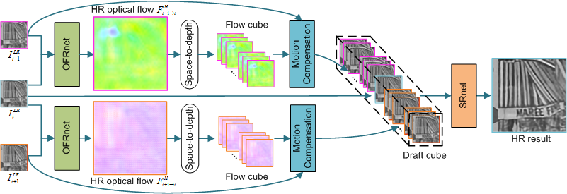

# SOF-VSR (Super-resolving Optical Flow for Video Super-Resolution)
Pytorch implementation of "Learning for Video Super-Resolution through HR Optical Flow Estimation", ACCV 2018.

[[arXiv]](http://arxiv.org/abs/1809.08573)

## Overview


Figure 1. Overview of our SOF-VSR network.

</div>

Figure 2. Comparison with the state-of-the-arts.

## Requirements
- Python 3
- pytorch (0.4), torchvision (0.2)
- numpy, PIL
- Matlab (For PSNR/SSIM evaluation)

## Datasets
We collect 145 1080P video clips from [the CDVL Database](http://www.cdvl.org) for training.

We use the Vid4 dataset and a subset of the DAVIS dataset (namely, DAVIS-10) for benchmark test.
- Vid4([BaiduPan](https://pan.baidu.com/s/1q947P3mvPaOjTZ5f1kXoTg), [GoogleDrive](https://drive.google.com/file/d/1ayb41qjur19Qq04kQewMHE5U2t-Sbwdw/view?usp=sharing))
- [DAVIS-10](https://davischallenge.org/)  
We use 10 scenes in the DAVIS-2017 test set including boxing, demolition, dive-in, dog-control, dolphins, kart-turn, ocean-birds, pole-vault, speed-skating and wings-trun.

## Train
Prepare training data in `data/train` directory as below:
```
  data
  └── train
      ├── video_1
            ├── hr
                    ├── hr0.png
                    ├── ...
                    └── hr30.png
            └── lr_x4_BI
                    ├── lr0.png
                    ├── ...
                    └── lr30.png
      ├── ...
      └── video_N
```

- Run on CPU:
```bash
python train.py --upscale_factor 4 --patch_size 32 --batch_size 16 --n_iters 300000
```

- Run on GPU:
```bash
python train.py --upscale_factor 4 --patch_size 32 --batch_size 16 --n_iters 300000 --gpu_mode True
```

## Test
We provide the pretrained model for 4x SR on BI degradation model. Note that we made some modifications to the original code and it should produce comparable or even better results.

- Run on CPU:
```bash
python demo_Vid4.py --video_name calendar --upscale_factor 4
```

- Run on GPU:
```bash
python demo_Vid4.py --video_name calendar --upscale_factor 4 --gpu_mode True
```

- Run on GPU (memory efficient):
```bash
python demo_Vid4.py --video_name calendar --upscale_factor 4 --gpu_mode True --chop_forward True
```

You can download [Vid4](https://pan.baidu.com/s/1q947P3mvPaOjTZ5f1kXoTg) dataset and unzip in `data/test` directory. Then you can test our network on other scenes.
## Results


Figure 3. Comparative results achieved on the Vid4 dataset. Zoom-in regions from left to right: **IDNnet**, **VSRnet**, **TDVSR**, our **SOF-VSR**, **DRVSR** and our **SOF-VSR-BD**. 


Figure 4. Comparative results achieved on the DAVIS-10 dataset. Zoom-in regions from left to right: **IDNnet**, **VSRnet**, our **SOF-VSR**, **DRVSR** and our **SOF-VSR-BD**. 


Figure 5. Visual comparison of 4x SR results. From left to right: **VSRnet**, **TDVSR**, our **SOF-VSR** and the **groundtruth**.

## Citation
```
@InProceedings{2018-LearningforVideoSuperResolutionthroughHROpticalFlowEstimation-LongguangWang--,
  author    = {Longguang Wang and Yulan Guo and Zaiping Lin and Xinpu Deng and Wei An},
  title     = {Learning for Video Super-Resolution through {HR} Optical Flow Estimation},
  booktitle = {ACCV},
  year      = {2018},
}
```
## Contact
For questions, please send an email to wanglongguang15@nudt.edu.cn
